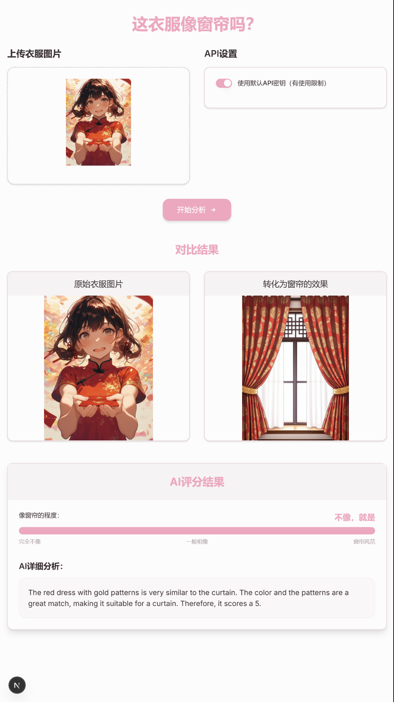

# 这衣服像窗帘吗？Gemini 2 示例项目（含生成图片）

获取 Gemini 2 [API_KEY](https://aistudio.google.com/apikey)

## 参考结果



## 开发

可选依赖（不在package中，需自行添加）：

1. @google/genai 是实验版的库，只是在脚本`script/genaijs.js`试用，可以不装
2. undici 解决国内node.js fetch 不默认走代理，而且相关库没有处理的问题。如果能用Github WorkSpace这种远程虚机处理会更好

典型报错：

```
Gemini API transformation error: Error: [GoogleGenerativeAI Error]: Error fetching from https://generativelanguage.googleapis.com/v1beta/models/gemini-2.0-flash-exp:generateContent: fetch failed
```

调试时可以考虑加上，但小心上传到生产：

```js
import { setGlobalDispatcher, ProxyAgent } from "undici";
const dispatcher = new ProxyAgent({ uri: new URL('http://127.0.0.1:7890').toString() });
setGlobalDispatcher(dispatcher);
```

## 参考

- [Get started with native image generation and editing using Gemini 2.0 and Next.js](https://github.com/google-gemini/gemini-image-editing-nextjs-quickstart)
- [API Reference](https://ai.google.dev/api?lang=node)
  - [Image Generation](https://ai.google.dev/gemini-api/docs/image-generation)